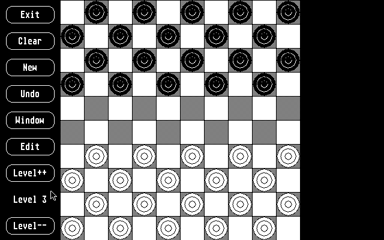

# Atari-ST-draughts

The game of international draughts for the Atari ST. 
Known as checkers in the US and 'dammen' in the Netherlands. 
The Dutch have a long tradition of draughts and had several world champions, 
such as Harm Wiersma and Jannes van der Wal. 
 
This Atari ST version was coded in 1990 by Marinus Jansen from the Netherlands. 
Developed on the Atari ST in GCC. 
Tested in 2022 and still working. 
 
Play against the computer at arbitrary depth ('diepte')  
At full depth it was unbeatable for amateur players. 
This version supports 'crowning' (dutch: 'dam'). 
 
It contains a simple GUI interface and mouse support. 
 
This fork is being coded in Pure C.
